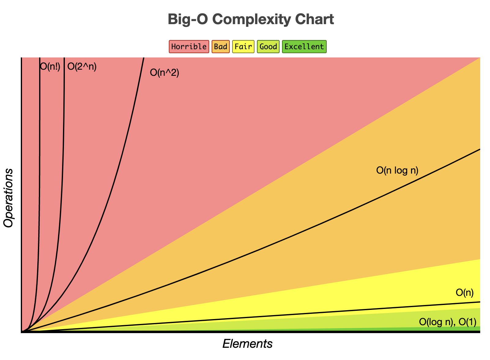

# Big O Cheat Sheet

Source: https://www.bigocheatsheet.com/

## Big O

- O(1) Constant - tanpa Loops
- O(log N) Logarithmic - Biasanya algoritma pencarian yang mempunyai log n jika mereka adalah sorted (Binary Search)
- O(n) Linear - for Loops, ketika loop sebanyak n item.
- O(n log(n)) Log Liniear - Biasanya operasi sorting
- O(n^2) Quadratic - Biasanya setiap element dalam collection butuh untuk di komparasi terhadap element yang pernah ada. Dua Nested Loop
- O(2^n) Exponential - Algoritma recursive yang menyelesaikan masalah dalam ukuran n
- O(n!) Faktorial - Kamu menambahkan loop untuk tiap element/n
  
- Iterasi setengah collection masih di anggap O(n)
- Dua collection yang terpisah: O(a*b)

## Apa yang menyebabkan waktu dalam function?
- Operasi (+, -, *, /)
- Comparation (<, >, ==)
- Looping(for, while)
- Outside Function Call (function())

## Rule Big O
- Rule 1: Selalu ambil kemungkinan terburuk (worst case)
- Rule 2: Hapus Nilai constant, jika misal ada sebanyak O(4) constant, maka akan tetap di anggap O(1) (Remove Constant)
- Rule 3: Input yang berbeda harus mempunyai variable yang berbeda. O(a + b). A dan B array nested harus menjadi O(a*b)
- Rule 4: Hilangkan yang tidak dominan, misal O(2 + 2n), maka akan tetap di anggap O(n)

## Apa yang menyebabkan Space Complexity>

- Variable
- Data Structure
- Function Call
- Allocations